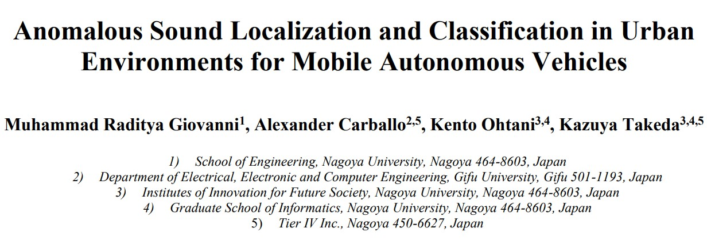
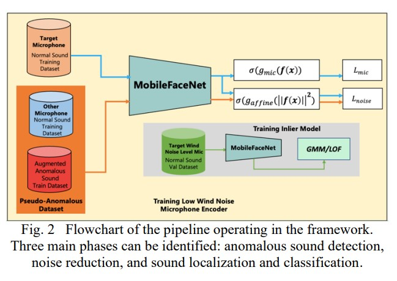
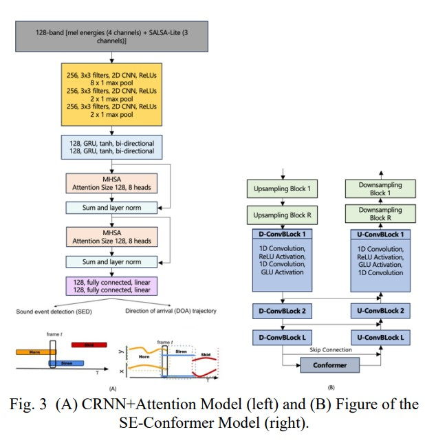

# Anomalous Sound Detection for Urban Vehicle
   


This repository contains the code and models developed for detecting, denoising, classifying, and localizing anomalous urban sounds to enhance autonomous vehicle safety. The work is based on the manuscript *"Anomalous Sound Localization and Classification in Urban Environments for Mobile Autonomous Vehicles"*.

> **Note:** Detailed instructions for using the `train.ipynb` notebook will be provided later.

---

## Overview

Autonomous vehicles must be able to perceive their surroundings using multiple modalities. In urban settings, visual sensors alone can be limited by occlusion, weather, and other factors. This project addresses these challenges by leveraging audio processing techniques to:

- **Detect anomalous sounds** (e.g., sirens, horns, tire skids, crashes) in noisy urban environments.
- **Denoise** the recorded audio using a time-domain approach that preserves both phase and amplitude information.
- **Classify and localize** the source of the detected sound, providing critical cues for safe navigation.

---

## Pipeline

The system is organized into three main phases:

1. **Anomalous Sound Detection**
   - Uses a combination of outlier and inlier models.
   - Outlier detection is performed using a lightweight network inspired by MobileFaceNets.
   - The inlier model employs a Gaussian Mixture Model (GMM) to compute anomaly scores based on a 128-dimensional latent feature space.


2. **Sound Denoising**
   - A modified SE-Conformer model is used for time-domain denoising.
   - This approach preserves both the absolute (amplitude) and phase information by minimizing losses computed on the raw waveform and the SALSA (Spatial Cue-Augmented Log-Spectrogram) features.
   
   

3. **Sound Classification and Localization**
   - A CRNN architecture, enhanced with an added self-attention layer, is implemented to jointly classify the sound type and estimate its direction.
   - This dual-task framework enables the system to accurately determine sound class (e.g., siren, horn, skid, crash) and its relative position even in challenging noisy conditions.
   
   


---

## Features

- **Robust Detection:** Capable of identifying anomalous sounds in environments with extremely low signal-to-noise ratios.
- **High-Quality Denoising:** Time-domain processing ensures that both phase and amplitude are maintained, leading to better reconstruction of the clean audio signal.
- **Accurate Localization and Classification:** Improved performance over baseline models, with significant reductions in directional error and high classification accuracy.

---

## Installation

To get started, follow these steps:

1. **Clone the repository:**
   ```bash
   git clone https://github.com/yourusername/anomalous_sound_detection_for_urban_vehicle.git
   cd anomalous_sound_detection_for_urban_vehicle
   ```

2. **Create and activate a Python virtual environment (optional but recommended):**
   ```bash
   python -m venv venv
   source venv/bin/activate  # On Windows, use: venv\Scripts\activate
   ```

3. **Install the required packages:**
   ```bash
   pip install -r requirements.txt
   ```

*Note: The `requirements.txt` file should list all dependencies required by the project (e.g., TensorFlow/PyTorch, NumPy, SciPy, etc.).*

---

## Usage

- Use `train_anomaly_detection.ipynb` for anomaly detection training.
- Use `train_doa.ipynb` for localization training.
- Use `train_waveunet_denoise.ipynb` for denoising training.

------

## Experimental Results

The proposed system has been evaluated using both simulated and real-world datasets:
- **Anomaly Detection:** Achieved an AUC of 0.99 with significant improvement over baseline models.
- **Sound Classification:** Reported classification accuracies of 95% on simulated data and 99% on real data.
- **Localization:** Achieved an average directional error as low as 10.82° on real recordings.

These results demonstrate the effectiveness of the three-phase approach under high-noise urban conditions.

---

## Citation

If you use this code in your research, please cite the associated manuscript:

> **Citation:**  
> Raditya Giovanni, M., Carballo, A., Ohtani, K., Takeda, K. *Anomalous Sound Localization and Classification in Urban Environments for Mobile Autonomous Vehicles*. Society of Automotive Engineers of Japan, Inc., 2023.

---

## License

MIT License

---

## Contributing

Contributions are welcome! Please open an issue or submit a pull request if you have suggestions or improvements.

---

## Contact

For questions or further information, please contact [mradityagio@gmail.com](mailto:mradityagio@gmail.com).

---
